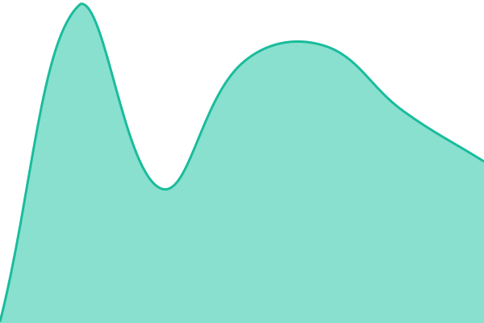
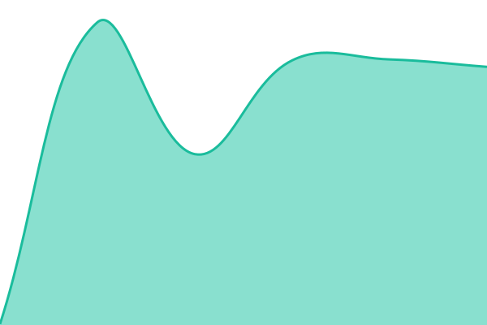
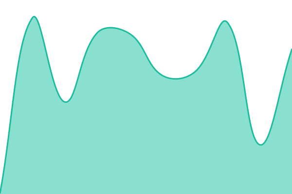
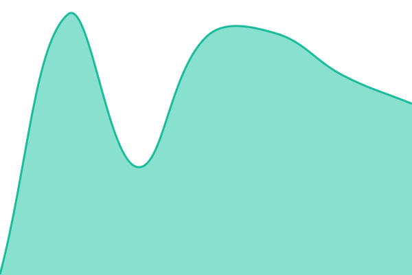
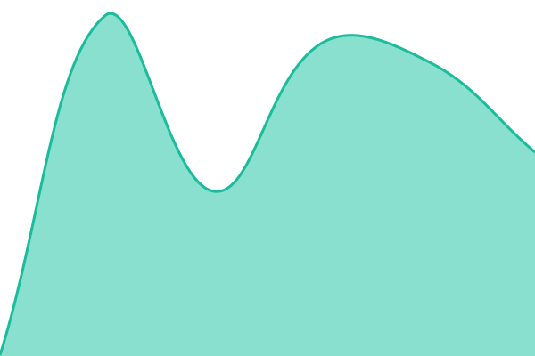
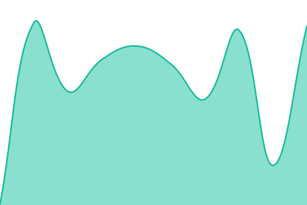
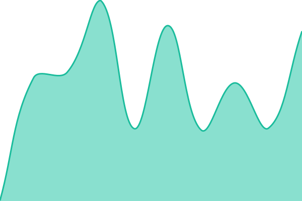
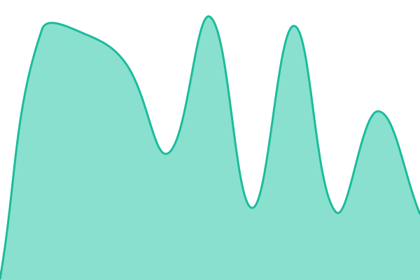
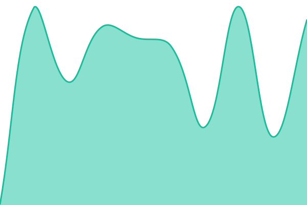
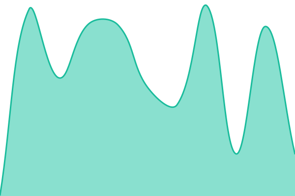

# [📈 Live Status](https://illuminationlab.github.io/status): <!--live status--> **🟩 All systems operational**

This repository contains the open-source uptime monitor and status page for [Illumination Lab](https://illuminationlab.github.io/status), powered by [Upptime](https://github.com/upptime/upptime).

With [Upptime](https://upptime.js.org), you can get your own unlimited and free uptime monitor and status page, powered entirely by a GitHub repository. We use [Issues](https://github.com/illuminationlab/status/issues) as incident reports, [Actions](https://github.com/illuminationlab/status/actions) as uptime monitors, and [Pages](https://illuminationlab.github.io/status) for the status page.

<!--start: status pages-->
<!-- This summary is generated by Upptime (https://github.com/upptime/upptime) -->
<!-- Do not edit this manually, your changes will be overwritten -->
<!-- prettier-ignore -->
| URL | Status | History | Response Time | Uptime |
| --- | ------ | ------- | ------------- | ------ |
|  [Illumination Lab](https://illuminationlab.io) | 🟩 Up | [illumination-lab.yml](https://github.com/illuminationlab/status/commits/HEAD/history/illumination-lab.yml) | 

 297ms
     
 | 

<a href="https://illuminationlab.github.io/status/history/illumination-lab">100.00%</a>
    

|  [Lead intake](https://intake.illuminationlab.io/ready) | 🟩 Up | [lead-intake.yml](https://github.com/illuminationlab/status/commits/HEAD/history/lead-intake.yml) | 

 176ms
     
 | 

<a href="https://illuminationlab.github.io/status/history/lead-intake">100.00%</a>
    

|  [Chief Automation Experts](https://chiefautomationexperts.com) | 🟩 Up | [chief-automation-experts.yml](https://github.com/illuminationlab/status/commits/HEAD/history/chief-automation-experts.yml) | 

 308ms
     
 | 

<a href="https://illuminationlab.github.io/status/history/chief-automation-experts">100.00%</a>
    

|  [CallAndCrawl](https://callandcrawl.com) | 🟩 Up | [call-and-crawl.yml](https://github.com/illuminationlab/status/commits/HEAD/history/call-and-crawl.yml) | 

 255ms
     
 | 

<a href="https://illuminationlab.github.io/status/history/call-and-crawl">100.00%</a>
    

|  [EngineGuild](https://engineguild.com) | 🟩 Up | [engine-guild.yml](https://github.com/illuminationlab/status/commits/HEAD/history/engine-guild.yml) | 

 242ms
     
 | 

<a href="https://illuminationlab.github.io/status/history/engine-guild">100.00%</a>
    

|  [FullTeeSheet](https://fullteesheet.com) | 🟩 Up | [full-tee-sheet.yml](https://github.com/illuminationlab/status/commits/HEAD/history/full-tee-sheet.yml) | 

 269ms
     
 | 

<a href="https://illuminationlab.github.io/status/history/full-tee-sheet">100.00%</a>
    

|  [GarageCowboys](https://garagecowboys.com) | 🟩 Up | [garage-cowboys.yml](https://github.com/illuminationlab/status/commits/HEAD/history/garage-cowboys.yml) | 

 285ms
     
 | 

<a href="https://illuminationlab.github.io/status/history/garage-cowboys">100.00%</a>
    

|  [KeptBlue](https://keptblue.com) | 🟩 Up | [kept-blue.yml](https://github.com/illuminationlab/status/commits/HEAD/history/kept-blue.yml) | 

 291ms
     
 | 

<a href="https://illuminationlab.github.io/status/history/kept-blue">100.00%</a>
    

|  [LashBooked](https://lashbooked.com) | 🟩 Up | [lash-booked.yml](https://github.com/illuminationlab/status/commits/HEAD/history/lash-booked.yml) | 

 325ms
     
 | 

<a href="https://illuminationlab.github.io/status/history/lash-booked">100.00%</a>
    

|  [LimoBooked](https://limobooked.com) | 🟩 Up | [limo-booked.yml](https://github.com/illuminationlab/status/commits/HEAD/history/limo-booked.yml) | 

 320ms
     
 | 

<a href="https://illuminationlab.github.io/status/history/limo-booked">100.00%</a>
    

|  [NeedleMoved](https://needlemoved.com) | 🟩 Up | [needle-moved.yml](https://github.com/illuminationlab/status/commits/HEAD/history/needle-moved.yml) | 

 316ms
     
 | 

<a href="https://illuminationlab.github.io/status/history/needle-moved">100.00%</a>
    

|  [PristineCircuit](https://pristinecircuit.com) | 🟩 Up | [pristine-circuit.yml](https://github.com/illuminationlab/status/commits/HEAD/history/pristine-circuit.yml) | 

 321ms
     
 | 

<a href="https://illuminationlab.github.io/status/history/pristine-circuit">100.00%</a>
    

|  [Rafter Elite](https://rafterelite.com) | 🟩 Up | [rafter-elite.yml](https://github.com/illuminationlab/status/commits/HEAD/history/rafter-elite.yml) | 

 279ms
     
 | 

<a href="https://illuminationlab.github.io/status/history/rafter-elite">100.00%</a>
    

|  [WattsBooked](https://wattsbooked.com) | 🟩 Up | [watts-booked.yml](https://github.com/illuminationlab/status/commits/HEAD/history/watts-booked.yml) | 

 313ms
     
 | 

<a href="https://illuminationlab.github.io/status/history/watts-booked">100.00%</a>
    

|  [WellnessEpicenter](https://wellnessepicenter.com) | 🟩 Up | [wellness-epicenter.yml](https://github.com/illuminationlab/status/commits/HEAD/history/wellness-epicenter.yml) | 

 312ms
     
 | 

<a href="https://illuminationlab.github.io/status/history/wellness-epicenter">100.00%</a>
    

<!--end: status pages-->

[**Visit our status website →**](https://illuminationlab.github.io/status)

## 📄 License

- Powered by: [Upptime](https://github.com/upptime/upptime)
- Code: [MIT](./LICENSE) © [Anand Chowdhary](https://anandchowdhary.com)
- Data in the `./history` directory: [Open Database License](https://opendatacommons.org/licenses/odbl/1-0/)
